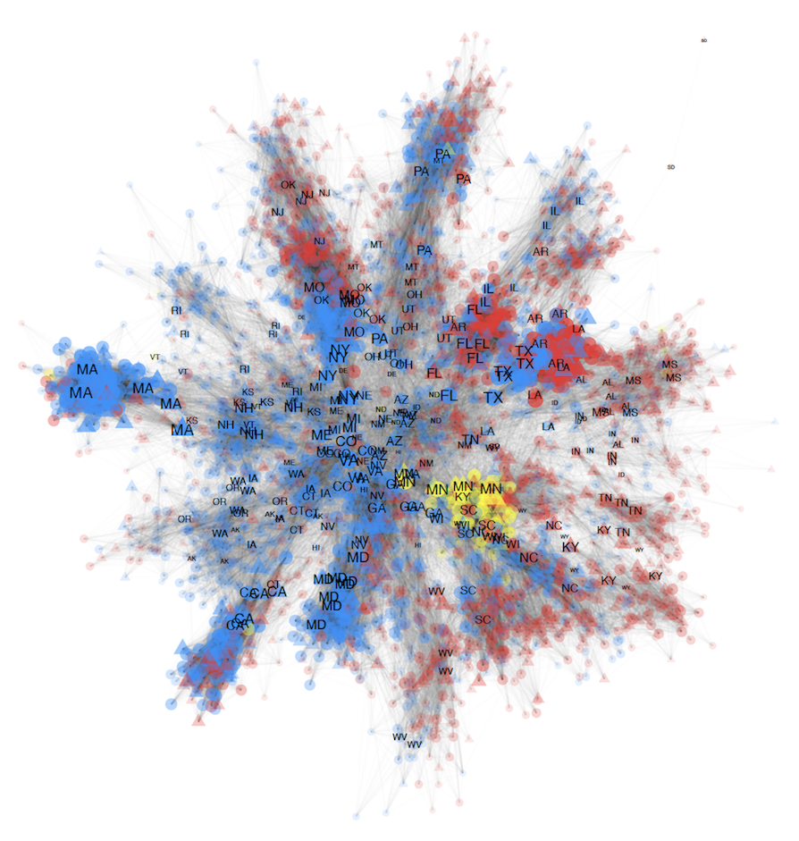

<h4>“Modeling State Legislator Networks on Twitter”</h4>

    

        

            Abstrct: A lot of attention has been paid to studying the online activity of the members of the United States congress. This scrutiny has not been extended to state legislators. Very few studies exist which catalogue why state legislators connect and communicate with one another online in the ways they do. Inspired by this question and building on studies which have analysed online communication of members of the national legislatures, this paper aims to systematically analyse state legislator relationships in the online environment. We collect original data for 4000+ legislators and study patterns of connection and communication of state legislators on Twitter. The results from this study will help better understand what motivates tie formation in the online environment and if these patterns of connection conform to or can predict offline relationships. We test the impact of variables such as party affiliation, state, chamber, cohort, gender, and policy area focus in the organisation of these online networks. We look at three main types of networks that can arise due to participation on Twitter - follower, retweets and mentions. We also aggregate the ties to infer dynamics between states.
        

        

            
        

    

##### <u>“Modeling State Legislator Networks on Twitter”</u>

<!-- [click here for the most recent version of the paper]({{ BASE_PATH}}/pages/working_papers/sample-working-paper.pdf) -->

<!-- Note: this is how to write a comment in HTML. Everything in here won't show up on your webpage.-->

<!--
To increase the size of the title, use fewer # in front of the paper title.
To decrease the size of the title, use more #. 
To remove the italics, remove the * before and after the description
To remove the underline from the title, remove the <u> tags (<u> and </u>)
-->